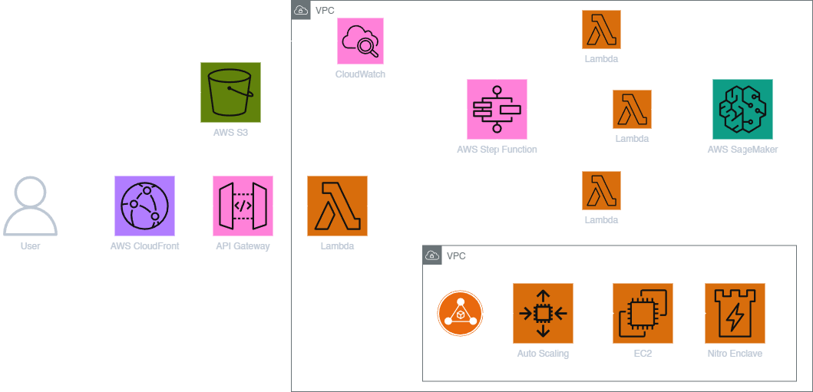

# Layer 8 Deployment

---

## Overview

Layer 8 is a cloud-native project deployed entirely on AWS, designed to protect user data. The architecture is structured into two distinct workflows:

## Project Architecture Diagram

## Regular User Requests

Regular user requests are managed through the following services:

- **AWS Lambda**: Provides serverless, on-demand execution for scalable processing.
- **AWS Step Functions**: Orchestrates complex workflows to manage multiple tasks and ensure smooth execution.
- **Amazon SageMaker**: Delivers scalable and high-performance machine learning processing for NLP tasks.
- **Amazon S3**: Stores static content, ensuring secure and reliable storage.
- **Amazon CloudFront**: Distributes static content globally, providing low-latency access.
- **API Gateway**: Manages all incoming traffic, ensuring secure, scalable API management.

## Enterprise-Grade Secure Processing

Sensitive, enterprise-grade processing is handled through:

- **EC2 Instances with AWS Nitro Enclaves**: Ensures confidential computing by isolating sensitive data in secure environments within EC2 instances.

---

## Architecture

**High-Level Flow:**

1. User interacts with a static website hosted on S3 via CloudFront.
2. API calls are made to AWS API Gateway.
3. API Gateway routes requests to a Main Lambda Handler.
4. Lambda inspects the API path and:
   - Triggers a Step Function for multi-step flows (e.g., Anonymize/Deanonymize).
   - Directly calls SageMaker endpoint for single queries.
5. Step Function orchestrates Lambda tasks and triggers:
   - Anonymize Lambda
   - Deanonymize Lambda
   - Query Lambda (which communicates with SageMaker)
6. Sensitive data operations are forwarded to an Auto Scaling EC2 Group behind an Application Load Balancer (ALB), with each EC2 running a Nitro Enclave.
7. Processed output is returned back through the API Gateway to the user.

---

## Technologies Used

- **Frontend:**

  - AWS S3 (Static Website Hosting)
  - AWS CloudFront (Content Delivery Network)

- **Backend:**

  - AWS API Gateway (HTTP API Routing)
  - AWS Lambda (Routing, Lightweight Processing)
  - AWS Step Functions (Workflow Orchestration)
  - AWS SageMaker (NLP Model Hosting for Inference)
  - AWS EC2 with Nitro Enclave (Secure Compute Environment)
  - AWS Application Load Balancer (ALB) + Auto Scaling Group (for EC2 scaling)

- **Security:**
  - AWS VPC (Private networking)
  - IAM Roles and Policies (Fine-grained Access Control)
  - CloudWatch (Monitoring and Logging)

---

## API Endpoints

| Endpoint              | Method | Description                     |
| :-------------------- | :----- | :------------------------------ |
| `/`                   | GET    | Health Check                    |
| `/anonymize`          | POST   | Anonymize Text                  |
| `/deanonymize`        | POST   | Deanonymize Text                |
| `/query`              | POST   | Process NLP Query               |
| `/anonymize/{text}`   | GET    | Anonymize Text (Direct Input)   |
| `/deanonymize/{text}` | GET    | Deanonymize Text (Direct Input) |
| `/query/{query}`      | GET    | Process Query (Direct Input)    |

---

## Deployment Steps

1. **Frontend Setup**

   - Upload frontend code to AWS S3 bucket (Static Website Hosting).
   - Set up CloudFront Distribution pointing to S3.

2. **Backend Setup**

   - Deploy Main Router Lambda.
   - Create and configure API Gateway routes.
   - Create Step Function for Anonymize and Deanonymize flows.
   - Deploy Anonymize, Deanonymize, and Query Lambda functions.
   - Deploy NLP Model to SageMaker Endpoint.

3. **EC2 and Nitro Enclave Setup**

   - Launch Nitro-compatible EC2 Instances.
   - Enable Nitro Enclaves on EC2.
   - Create Application Load Balancer and Target Group for EC2 Auto Scaling Group.
   - Set Health Check endpoint for ALB.

4. **Security and Monitoring**
   - Configure IAM Roles for Lambda, EC2, SageMaker.
   - Enable CloudWatch Logs and Alarms for monitoring.

---

## Key Features

- Highly secure NLP processing with **AWS Nitro Enclave**.
- Fully serverless and scalable architecture.
- Proper separation between frontend and backend layers.
- Modular API design for easy scaling and feature addition.
- Low latency inference with SageMaker-managed NLP models.

---
